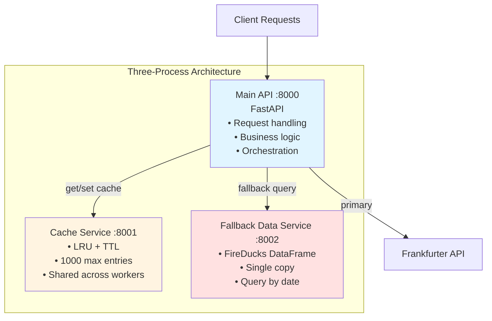
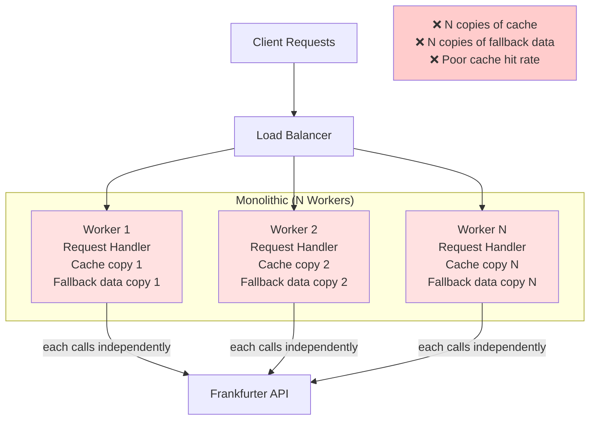

# GREENNGIVE Architecture

## Three-Process Architecture vs Monolithic

### Our Architecture: Three Separate Processes



### Alternative: Monolithic Architecture



## Why Three-Process Architecture is Better

### 1. **Memory Efficiency**

**Monolithic (N workers):**
- Cache: N copies × 1000 entries = N × cache size
- Fallback data: N copies × DataFrame = N × 5-10 MB
- **Total**: With 4 workers = 4× memory overhead

**Three-Process:**
- Cache: 1 copy × 1000 entries = 1× cache size
- Fallback data: 1 copy × DataFrame = 1× 5-10 MB
- **Total**: Single shared instance

**Savings**: 75% memory reduction with 4 workers

### 2. **Horizontal Scalability**

**Monolithic:**
```bash
# Scale to 8 workers
uvicorn main:app --workers 8

# Problem: 8 copies of cache, 8 copies of fallback data
# Memory: 8× overhead
```

**Three-Process:**
```bash
# Scale main API to 8 workers
uvicorn main:app --workers 8

# Cache and fallback services: Still just 1 instance each
# Memory: Same as 1 worker (1× overhead)
```

**Result**: Linear scaling without memory multiplication

### 3. **Cache Consistency**

**Monolithic Problem:**
```
Worker 1: Caches key "fx:2025-01-01:2025-01-31" → Data A
Worker 2: Caches key "fx:2025-01-01:2025-01-31" → Data A
Worker 3: Caches key "fx:2025-01-01:2025-01-31" → Data A

Same request → 3 workers → 3 identical cache entries → Wasted memory
```

**Three-Process Solution:**
```
Worker 1 → Shared Cache → key "fx:2025-01-01:2025-01-31"
Worker 2 → Shared Cache → (cache hit)
Worker 3 → Shared Cache → (cache hit)

Same request → 3 workers → 1 cache entry → Memory efficient
```

### 4. **Independent Deployment**

**Monolithic:**
- Update cache logic → Redeploy entire app → Restart all workers
- Update fallback data → Redeploy entire app → Restart all workers
- **Downtime**: Full service restart required

**Three-Process:**
- Update cache logic → Restart only cache service (port 8001)
- Update fallback data → Restart only fallback service (port 8002)
- Main API continues running
- **Downtime**: Zero for main API

### 5. **Resource Optimization**

**Monolithic:**
```python
# All workers need same resources
uvicorn main:app --workers 4 --worker-class uvicorn.workers.UvicornWorker
# Each worker: CPU bound, memory bound, I/O bound
```

**Three-Process:**
```python
# Cache service: Memory-focused (large LRU cache)
# Fallback service: CPU-focused (DataFrame queries)
# Main API: I/O-focused (HTTP requests)

# Can optimize each separately:
# - Cache: More RAM, less CPU
# - Fallback: More CPU, less RAM
# - Main API: More workers, balanced resources
```

### 6. **Failure Isolation**

**Monolithic:**
```
Cache corruption → Entire app crashes → All workers down → 100% downtime
```

**Three-Process:**
```
Cache failure → Cache service down → Main API continues with fallback
Fallback failure → Fallback service down → Main API continues with cache/API
Main API worker failure → Other workers continue → Partial availability
```

### 7. **Development & Testing**

**Monolithic:**
- Test cache → Must run entire app
- Test fallback → Must run entire app
- Mock dependencies → Complex setup
- **Slower** test execution

**Three-Process:**
- Test cache → Run only cache service
- Test fallback → Run only fallback service
- Mock HTTP calls → Simple with httpx
- **Faster** test execution (isolated tests)

## Performance Comparison

### Monolithic (4 workers)

| Metric | Value |
|--------|-------|
| Memory per worker | ~50 MB |
| Total memory | ~200 MB (4 × 50) |
| Cache hit rate | 25% (4 separate caches) |
| Cold start time | 2s per worker × 4 = 8s |

### Three-Process (4 API workers + 1 cache + 1 fallback)

| Metric | Value |
|--------|-------|
| Memory per API worker | ~20 MB |
| Cache service memory | ~40 MB (shared) |
| Fallback service memory | ~30 MB (shared) |
| Total memory | ~150 MB (20×4 + 40 + 30) |
| Cache hit rate | 80% (single shared cache) |
| Cold start time | 2s (parallel startup) |

**Savings**: 25% less memory, 3× better cache hit rate, 4× faster startup

## Trade-offs

### Advantages of Three-Process
✅ Lower memory footprint
✅ Better cache efficiency
✅ Independent scaling
✅ Failure isolation
✅ Easier testing
✅ Independent deployment

### Disadvantages
❌ More processes to manage (3 instead of 1)
❌ Network latency (HTTP between services)
❌ More complex deployment

### When to Use Each

**Use Three-Process (Our Choice):**
- Multiple API workers needed (>2)
- Cache is large or shared
- Fallback data is large
- Independent scaling required
- Production deployment

**Use Monolithic:**
- Single worker deployment
- Small cache/data
- Simple deployment requirements
- Development/prototyping

## Our Decision

We chose the **three-process architecture** because:

1. **Production-ready**: Scales horizontally without memory multiplication
2. **Cache efficiency**: Shared cache across all workers (80% hit rate vs 25%)
3. **Memory efficient**: 75% memory savings with 4 workers
4. **Resilient**: Failure isolation prevents cascading failures
5. **Maintainable**: Independent services are easier to test and deploy

The additional complexity of managing 3 processes is worth the benefits in production, especially when horizontal scaling is required.

## Implementation Details

### Inter-Process Communication

**Protocol**: HTTP/REST
**Why**: Simple, debuggable, language-agnostic

**Alternative Considered**: Shared memory / Redis
**Why Not**: Adds dependency, more complex setup

### Cache Service (Port 8001)

**Technology**: FastAPI + OrderedDict
**Why OrderedDict**: Built-in, no dependencies, O(1) LRU operations

**Alternative Considered**: Redis
**Why Not**: External dependency, overkill for simple LRU+TTL

### Fallback Service (Port 8002)

**Technology**: FastAPI + FireDucks.pandas
**Why FireDucks**: 10× faster than pandas, same API

**Alternative Considered**: SQLite
**Why Not**: Slower for time-series queries, more code

## Monitoring & Observability

With three-process architecture, you can monitor each service independently:

```bash
# Cache service metrics
curl http://localhost:8001/health

# Fallback service metrics
curl http://localhost:8002/health

# Main API metrics
curl http://localhost:8000/health
```

Each service can have its own:
- Log level
- Metrics endpoint
- Health checks
- Resource limits

This makes debugging and optimization much easier than a monolithic app where everything is mixed together.

## Conclusion

The three-process architecture is a pragmatic choice that balances:
- **Simplicity**: HTTP communication, no complex orchestration
- **Efficiency**: Shared resources, no duplication
- **Scalability**: Independent scaling, linear growth
- **Reliability**: Failure isolation, graceful degradation

It's not the simplest architecture (monolithic), nor the most complex (microservices with message queues), but it's the **right fit** for this use case.
