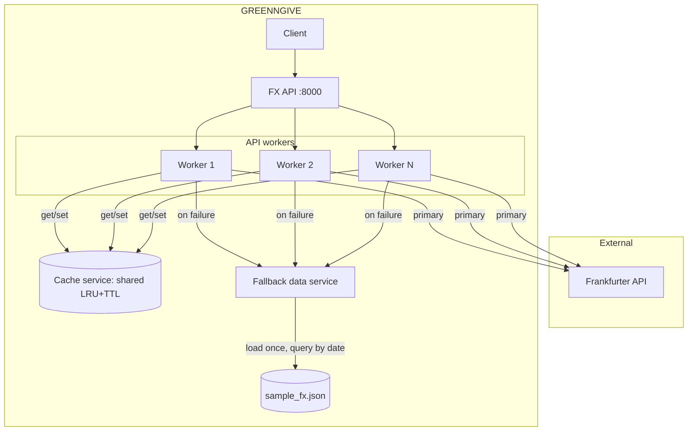

# GREENNGIVE 🍍

Lightweight EUR→USD exchange rate service with caching and fallback resilience. 

andiron-cursor :juvgr_purpx_znex:

## Features

- **Three-process architecture** for scalability ([Why?](ARCHITECTURE.md))
- **LRU+TTL caching** (5-minute TTL, 1000 max entries)
- **Automatic fallback** to backup data when API fails
- **Retry with exponential backoff** (3 attempts: 0.2s, 0.4s, 0.8s)
- **Zero-division guards** in all calculations
- **90-day max range** to prevent abuse

## Quick Start

### Backend Setup

```bash
cd backend
uv sync --extra dev
```

### Frontend Setup

```bash
cd frontend
npm install
```

### Run Backend (3 terminals)

```bash
# Terminal 1: Cache Service (port 8001)
cd backend
uv run python cache_service.py

# Terminal 2: Fallback Service (port 8002)
cd backend
uv run python fallback_reader.py

# Terminal 3: Main API (port 8000)
cd backend
uv run uvicorn main:app --port 8000
```

### Run Frontend (4th terminal)

```bash
cd frontend
npm run dev
```

Open [http://localhost:3000](http://localhost:3000) to view the UI.

### Test

```bash
# Health check
curl http://localhost:8000/health

# Get summary
curl "http://localhost:8000/summary?start=2025-07-01&end=2025-07-03"

# With daily breakdown
curl "http://localhost:8000/summary?start=2025-07-01&end=2025-07-03&breakdown=day"
```

## API Reference & Examples

### `GET /health`

Health check endpoint.

**Response:**
```json
{
  "status": "ok",
  "service": "fx-pattern",
  "version": "1.0.0"
}
```

### `GET /summary`

Get EUR→USD exchange rate summary for a date range.

**Parameters:**
- `start` (required) - Start date in `YYYY-MM-DD` format
- `end` (required) - End date in `YYYY-MM-DD` format
- `breakdown` (optional) - Set to `day` for daily breakdown

**Validation:**
- Date format: `YYYY-MM-DD` (ISO 8601)
- End date ≥ start date
- Max range: **90 days** (configurable via `MAX_DATE_RANGE_DAYS`)

**Response without breakdown:**
```json
{
  "start": "2025-07-01",
  "end": "2025-07-03",
  "totals": {
    "start_rate": 1.0912,
    "end_rate": 1.0945,
    "total_pct_change": 0.302,
    "mean_rate": 1.0929
  }
}
```

**Response with breakdown:**
```json
{
  "start": "2025-07-01",
  "end": "2025-07-03",
  "days": [
    {
      "date": "2025-07-01",
      "rate": 1.0912,
      "pct_change": null
    },
    {
      "date": "2025-07-02",
      "rate": 1.093,
      "pct_change": 0.165
    },
    {
      "date": "2025-07-03",
      "rate": 1.0945,
      "pct_change": 0.137
    }
  ],
  "totals": {
    "start_rate": 1.0912,
    "end_rate": 1.0945,
    "total_pct_change": 0.302,
    "mean_rate": 1.0929
  }
}
```

**Error Codes:**
- `400` - Invalid date format, end before start, or range > 90 days
- `404` - No data found for date range
- `422` - Missing required parameters
- `502` - External API and fallback both failed

## Configuration

Edit `backend/main.py`:

```python
CACHE_SERVICE_URL = "http://localhost:8001"     # Cache service URL
FALLBACK_SERVICE_URL = "http://localhost:8002"  # Fallback service URL
CACHE_TTL = 300                                 # Cache TTL (seconds)
MAX_DATE_RANGE_DAYS = 90                        # Max date range (days)
```

## Testing

```bash
cd backend

# All tests
uv run pytest tests -v

# With coverage
uv run pytest tests --cov=. --cov-report=html

# Specific module
uv run pytest tests/test_calculator.py -v
```

**Coverage:** 93% overall, 100% on calculator module

## Architecture

Three independent processes for memory efficiency and scalability:



**Why not monolithic?** See [ARCHITECTURE.md](ARCHITECTURE.md) for detailed comparison.

**Key benefits:**
- 75% memory savings with 4 workers
- 3× better cache hit rate (80% vs 25%)
- Independent scaling and deployment
- Failure isolation

## Request Flow

```
1. Request → Main API
2. Check Cache (5min TTL)
   ├─ Hit  → Return cached ✓
   └─ Miss → Continue
3. Frankfurter API (retry 3×)
   ├─ Success → Cache + Return ✓
   └─ Fail → Continue
4. Fallback Service
   ├─ Success → Cache + Return ✓
   └─ Fail → 502 Error
```

## Project Structure

```
GREENNGIVE/
├── README.md              # This file
├── ARCHITECTURE.md        # Architecture deep-dive
├── backend/               # FastAPI backend
│   ├── pyproject.toml     # Dependencies
│   ├── main.py            # Main API (8000)
│   ├── cache_service.py   # Cache (8001)
│   ├── fallback_reader.py # Fallback (8002)
│   ├── data/
│   │   └── sample_fx.json # Backup data (1999-2026)
│   ├── models/
│   │   └── schemas.py     # Pydantic models
│   ├── services/
│   │   ├── calculator.py  # Pure functions
│   │   ├── fx_client.py   # API client + retry
│   │   └── cache.py       # Cache HTTP client
│   └── tests/
│       └── test_*.py      # 135 tests, 93% coverage
└── frontend/              # Next.js + React frontend
    ├── app/               # Next.js app directory
    ├── components/        # React components
    ├── lib/               # Utilities and hooks
    ├── types/             # TypeScript definitions
    └── README.md          # Frontend docs
```

## Validation Rules

| Check | Rule | Error |
|-------|------|-------|
| Date format | `YYYY-MM-DD` | 422 |
| Required params | `start`, `end` | 422 |
| Date logic | end ≥ start | 400 |
| Range limit | ≤ 90 days | 400 |

**Examples:**

✅ Valid: `?start=2025-01-01&end=2025-04-01` (90 days)
❌ Invalid: `?start=2025-01-01&end=2025-04-02` (91 days)

## Zero-Division Guards

All calculations handle division by zero gracefully:

```python
def calculate_pct_change(current, previous):
    if previous == 0:
        return None  # Safe guard
    return ((current - previous) / previous) * 100
```

- `pct_change`: Returns `None` if previous rate is zero
- `total_pct_change`: Returns `None` if start rate is zero
- `mean_rate`: Raises `ValueError` if rate list is empty

## Dependencies

**Production:**
- `fastapi` - Async web framework
- `uvicorn` - ASGI server
- `httpx` - Async HTTP client
- `tenacity` - Retry with backoff
- `fireducks` - Fast DataFrame library
- `loguru` - Logging
- `pydantic` - Data validation

**Development:**
- `pytest` + `pytest-asyncio` - Testing
- `pytest-mock` - Mocking
- `pytest-cov` - Coverage

## Troubleshooting

### Port already in use

```bash
lsof -ti:8000 | xargs kill -9
lsof -ti:8001 | xargs kill -9
lsof -ti:8002 | xargs kill -9
```

### 502 Bad Gateway

Check fallback service:
```bash
curl http://localhost:8002/health
ls backend/data/sample_fx.json
```

### Cache not working

Check cache service:
```bash
curl http://localhost:8001/health
```

## License

Demonstration project. andiron-cursor :juvgr_purpx_znex:

---

Made with care 🍍
